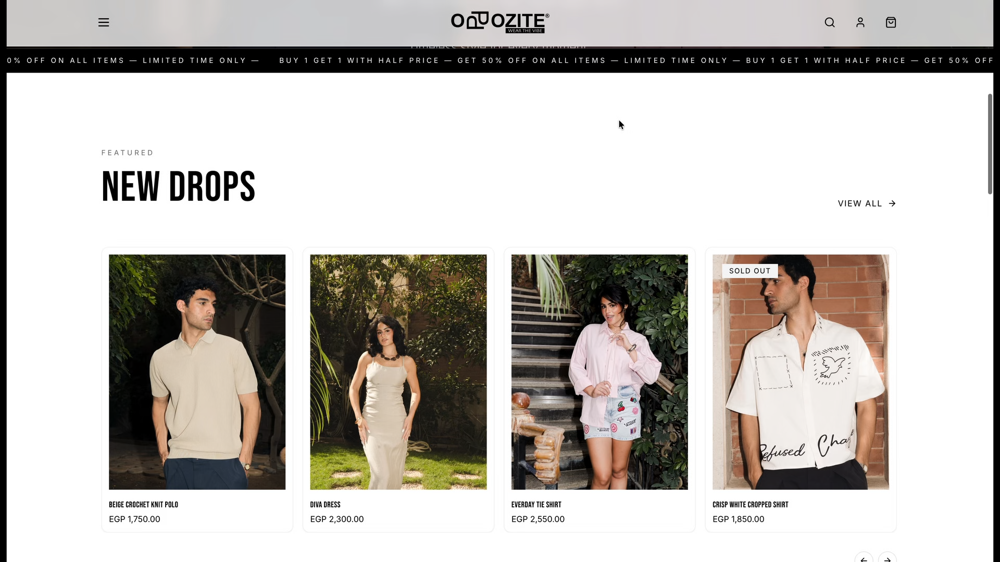
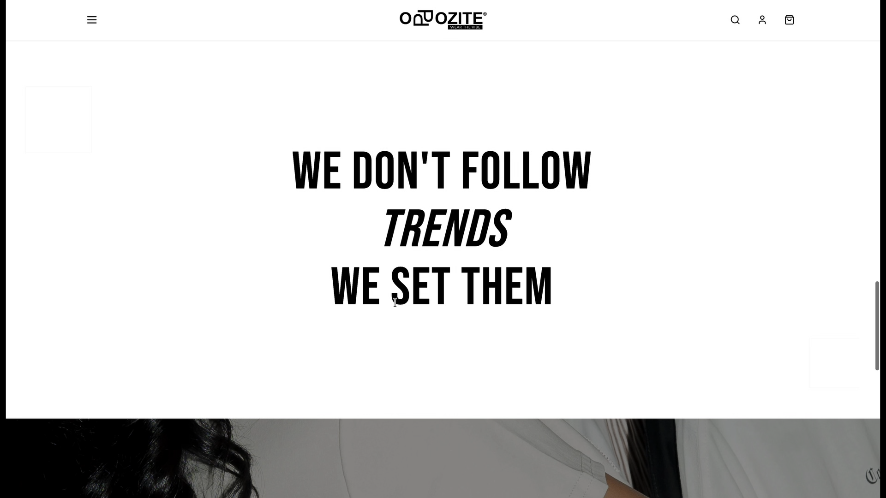
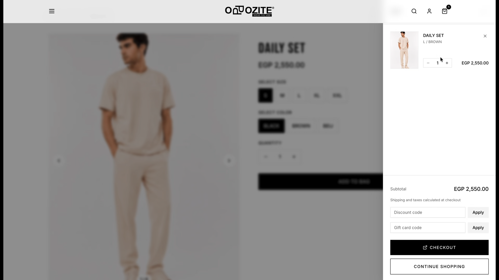

# Oppozite Hydrogen — Headless Ecommerce

> ⚠️ Source code is private. This repo is a public showcase — overview, stack, and features only.

---

## Screenshots

 

---

## Overview

Oppozite Hydrogen is a headless ecommerce storefront built on Shopify's [Hydrogen](https://hydrogen.shopify.dev/) framework. It separates the storefront from the Shopify backend, giving full control over UX and performance while keeping Shopify's commerce infrastructure.

## Tech Stack

- **Framework**: Shopify Hydrogen (Remix-based)
- **Frontend**: React + TypeScript
- **Rendering**: React Server Components + streaming SSR
- **Styling**: Tailwind CSS
- **API**: Shopify Storefront API (GraphQL)

## Key Features

- Server-side rendering with React Server Components
- Streaming HTML for fast time-to-first-byte
- Full product catalog, collection pages, and PDPs
- Cart with optimistic UI
- Custom checkout integration
- SEO-optimized with meta tags and structured data

## Why Hydrogen?

Hydrogen unlocks full frontend flexibility on top of Shopify's battle-tested commerce engine — best of both worlds for performance-critical storefronts.

## Contact

Interested in a headless commerce project? Reach out at [fahdgamad080@gmail.com](mailto:fahdgamad080@gmail.com)
